MockTrade 
===============================

##### &lt;TL;DR&gt;

* Open Source Android Trading Simulator
* AppFramework Library
    * BaseAppCompatActivity with built in MVP
        * Error Handling
    * Annotation Driven List/Create/Edit Layouts
    * SqlConnection Encapsulation
        * Domain Objects
        * SqlMapper pattern
        * Create and Upgrade via SQL scripts
* MockTrade Application
    * Trading Simulation Business Logic
    * Teach Trading Basics and Strategies 
        * Dogs of the Dow
        * Strategy plugin model
    * Implements AppFramework
* Watch Face Wear Application
    * 24hr Ring showing when Markets are open
        * Color coded to indicate portfolio performance
    * Portfolio Highlights Synced From Mobile App
        * Portfolio Totals/Best & Worst Day and Total Performers
        * Uses Wearable Data Layer API
    * Library Module for classes shared between Mobile and Wear Apps

##### &lt;/TL;DR&gt;

### MockTrade Application
Lets get this out of the way, this app is very much a WIP and still has 
some roughness around the edges. All balances in the application are purely 
virtual and have no value in the real world. The author is not responsible 
for any virtual gains or loses that occur in the application. 

Welcome to the MockTrade project!! This open source application is an Android 
based Trading Simulator. The application allows the user to create virtual 
portfolios and track performance over a period of time. The goal is to 
provide a basic learning trading tool to empower the next generation of investors. 

### Application Framework
The project includes the AppFramework Library which provides generic services 
to the MockTrade application. The AppFramework afforded me an opportunity to 
explore some Application Architecture ideas and apply them to the Android platform. 

**Highlights:**

* SqlConnection Service
    * sqlite encapsulation
    * SqlMapper pattern
    * auto id, create_time, and update_time column management
    * database creation and upgrade via SQL script assets
* Model/View/Presenter Support
    * Model - Interfaces describing data retrieval and persistence functionality
        * abstracts data contract from data source
        model implementations that are managed by the framework.
    * View - Extends Android ViewGroup classes
        * caches controls (ViewHolder pattern)
        * provides Listener interfaces to communicate with Presenter
        * facilitates binding to Business/Domain Object patterns
    * Presenter - BaseAppCompatActivity classes to facilitate MVP
        * coordinates interactions between the View and Model 
        * error handling framework for exceptions thrown from the Presenter. 
        * provide system services to business logic
* Metadata Driven Create/Edit screens
    * Annotations to define Labels and input types and restrictions
    * Supports custom control injection to allow for advanced functionality
    * ExternalController model to allow custom validation and advanced UI behavior

### Next Steps
* Investment/Account/Order Detail Screens
* Gamification
* Option Chains

### Screenshots

Main portfolio screen. View multiple portfolios with totals pinned to the bottom

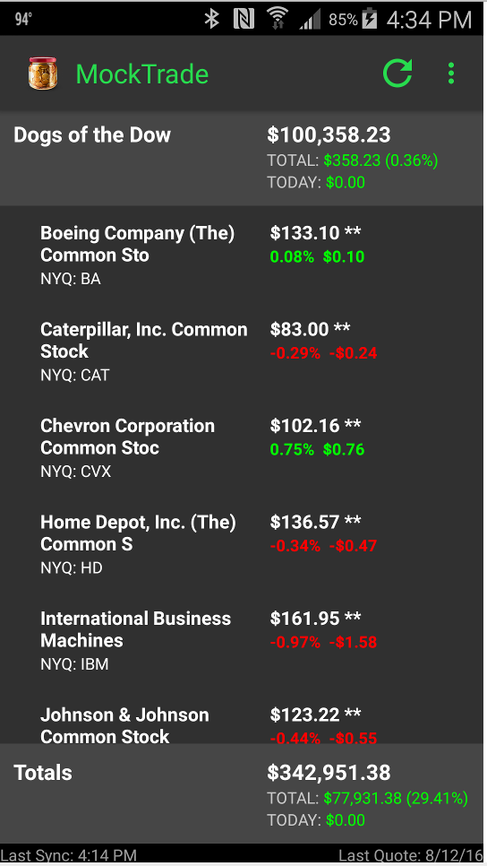

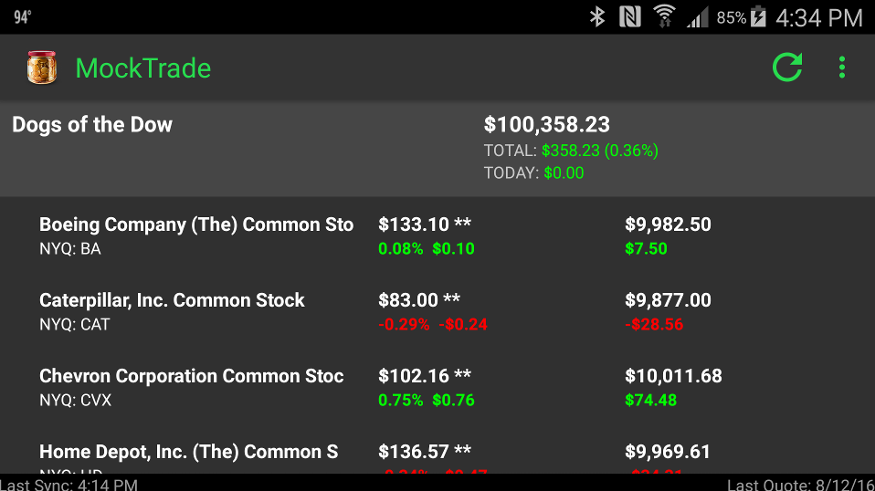

Slide screen down to reveal daily performance chart

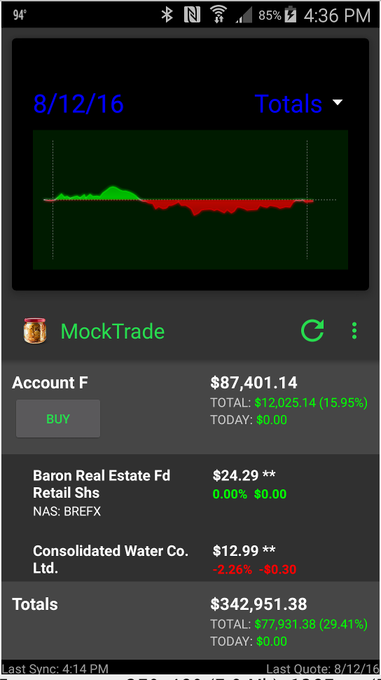

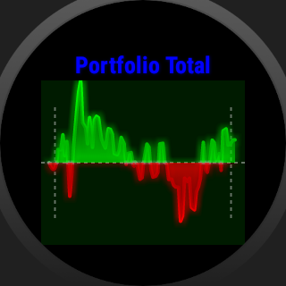

Create a new portfolio. User can create a normal portfolio and
manage their own assets, or choose a strategy and track the
performance over time

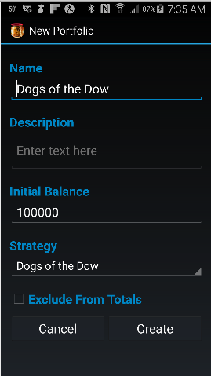

Sell screen showing a Trailing Stop % order type

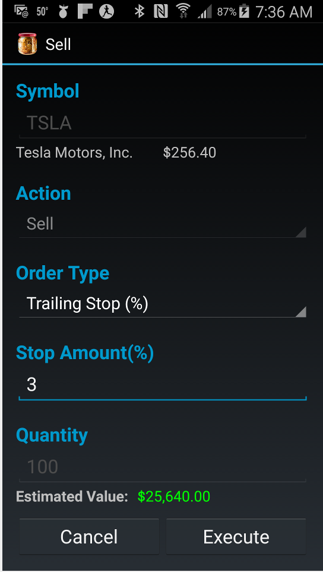

Buy screen with real-time quote and order validation

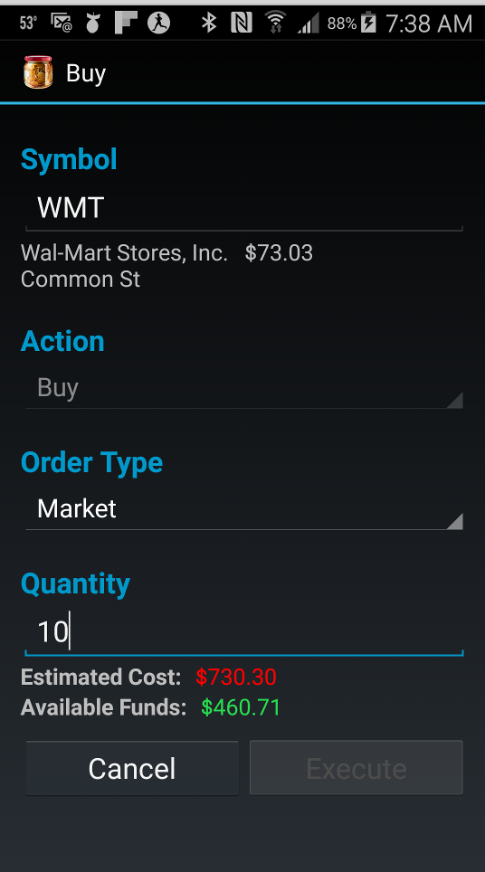

WatchFaces

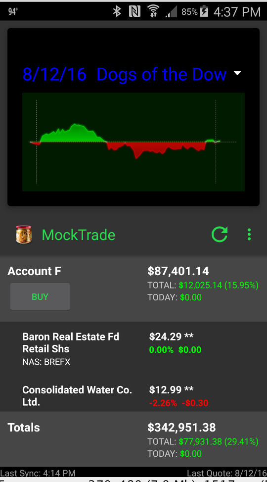
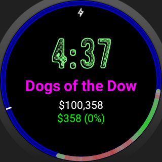

Changes to watchface reflect in application

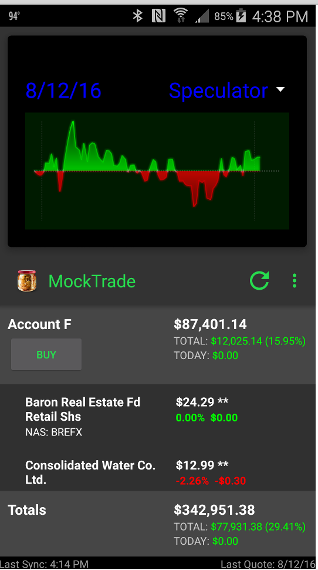
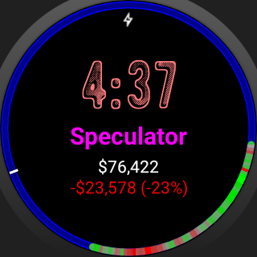

Tapping on performance ring zooms to 12hr view

### Attributions
* Awesome icon site: http://www.iconarchive.com/
    * [Ecommerce Business Icons by DesignContest](http://www.designcontest.com) 
        * http://creativecommons.org/licenses/by/4.0/
        * No Changes Made
    * [Enjoyment Icons by IcoJoy](http://www.icojoy.com)
    * [Must Have Icons by VisualPharm](http://www.visualpharm.com/)
    * [My Secret Icons by ArtDesigner.lv](http://artdesigner.lv/) 

